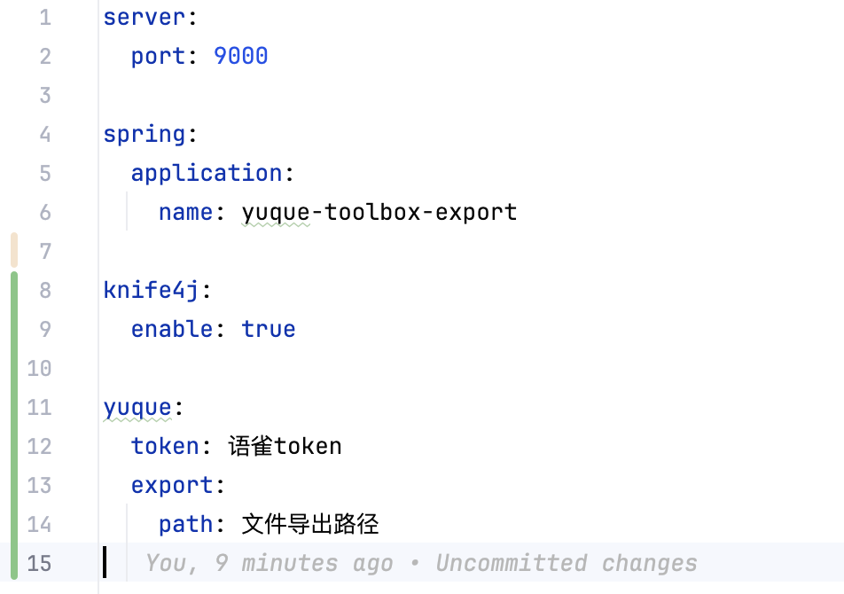
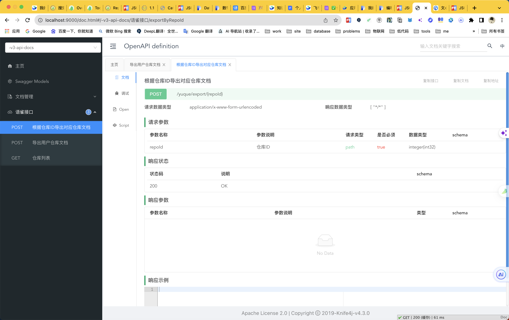

# yuque-toolbox

## 用途描述

> 便于个人导出备份， 同时提供Java版本 yuque-sdk 
> 
> 目前仅支持markdown文档导出，其它类型文档暂未实现

## 环境&版本
* spring-boot 3.1.2
* forest 1.5.32

## 模块
* yuque-export  语雀文档导出主程序
* yuque-sdk  语雀api sdk实现

### yuque-sdk 用法
```yaml
yuque:
  # 默认值即为 ： https://www.yuque.com/api/v2
  base-url: https://www.yuque.com/api/v2
  # 语雀token
  token: token
  # 文档导出路径
  export:
    path: /data
```
### yuque-export 用法

1. 安装java环境（**jdk17**）
2. 指定配置变量（语雀token, 导出路径）,如下所示


3. 启动项目
> 1. 直接源码启动
> 2. jar 文件启动, 启动命令如下：
> > java -jar yuque-export.jar --yuque.token={语雀token} --yuque.export.path={文件导出路径}

4. 访问 http://127.0.0.1:9000/doc.html, 效果图如下:


### yuque token 获取方法


## 语雀文档

[开发者文档](https://www.yuque.com/yuque/developer)